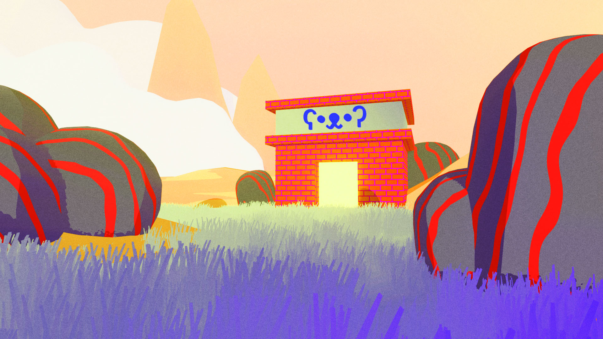
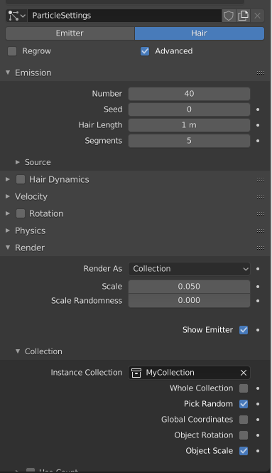

## Building 3D Worlds in Blender

February 14, 2021

Seamus Edson

@worm_pilled

@rustforms

## Overview

Turn an idea into a world. This workshop is a rapid-fire introduction to making 3D environments from scratch with Blender. We will take an artist-friendly approach as we walk through a variety of tools and workflows.

## Lesson Plan

1. Setup
2. Interface and 3D viewport
3. Basic modeling
4. Make a terrain
5. Spawn objects with particle systems
6. Materials and lights
7. Placing camera and rendering
8. Shader Editor

## Note on difficulty

This is meant to be a friendly (but fast-paced) introduction to many topics in Blender. We are not going to go super in depth on any one topic. Please tell me to slow down or speed up if need be.

## Setup

Edit > Preferences
- Input > Emulate 3 Button Mouse (if using trackpad)
- Keymap > Spacebar Action > Search

## Some hot keys

| Key        | Action                          |
| ---------- | ------------------------------- |
| TAB        | Toggle Object/Edit Mode         |
| N          | Toggle info panel               |
| A          | Select all                      |
| Option + A | Deselect all                    |
| Shift + A  | Create new (depends on context) |
| G          | Grab (move)                     |
| R          | Rotate                          |
| S          | Scale                           |
| Shift + D  | Duplicate                       |
| Shift + C  | Reset 3D cursor                 |

## Interface

The 3D Viewport is the large area in the center. There are tools for manipulating 3D objects on the left side. Pay attention to the gizmo that shows current orientation in the top right. Hit the (N) key to open an options panel.

The Outliner (top right) shows all the objects in the scene and lets you organize them into collections. We will use this feature in the second part of the workshop.

The Properties area (bottom right) exposes information and effects relating to each individual object.

## 3D Viewport

Left click to select objects.

Rotate view - middle mouse button to Option + left click on trackpad.

Scroll to zoom (mouse) or Command + Scroll (trackpad)

Shift + middle mouse to pan view;

(X) to delete. (Shift + A) to add a new objects.

## Object vs Edit mode

- Object Mode is course -- I can manipulate objects as a whole by moving, rotating, and scaling
- Edit Mode is fine -- I can edit the internal data of any object
- Select objects with left click and toggle into/out of Edit Mode with TAB

## Basic Modeling

In Object mode:
  - Shift + A -> choose your base mesh
  - There is a (usually closed) popup on the bottom left that has options for each base mesh
  - Practice moving, rotating, and scaling it
  - Right Click on objects to switch between smooth and flat shading

Use TAB (or Menu) to go into Edit Mode:
  - Mess with the vertices, edges, and faces
  - Play with Extrude (E) and Inset (I)

For this workshop, I am going to model two different kinds of things (rocks and trees) and make a couple variations of each. For the next steps to work, make sure to have each type of object inside its own collection (rock models in a rock collection). Create collections by right clicking in the Outliner (top right).

## Make a terrain

We can use a black and white noise texture to manipulate a flat plane and turn it into a 3D terrain.

In Object Mode:
  - Shift A -> Choose Grid
  - Open the additional options (bottom left) and choose something like 40 x 40 subdivisions
  - Scale is up 10 - 20 times the size (S + 10 would scale by a factor of ten)
  - Select the grid and find the Modifiers Panel (blue wrench)
  - Use the Add Modifier drop down to add 2 special effects to this terrain: Subdivision Surface and Displace

Subdivision Surface adds extra detail. You can have different numbers of subdivisions for previewing and rendering. I am going to set both to 2 for now.

Displace lets you warp a mesh based on the black and white values of an image. Darker pixels become low points and lighter pixels become high points.

In the Displace Modifier:
  - Click the big "New" button to attach this object to a new texture
  - Then navigate to the textures panel (red checkerboard at bottom)
  - Change the drop down that says "Image or Movie" to any one of Blender's noise varieties
  - Clouds and Voronoi are my favorites but play with them all
  - Use the options and sliders to dial in something nice
  - BONUS: Open the Colors options for the texture and Enable Color Ramp to mess with stuff even more

## Spawn objects with particle systems

Particle Systems will let us randomly spawn objects across our terrain. With the terrain grid selected, open the particle settings panel (blue molecule below the blue wrench). Add a new particle system with the "+" button.

Here are the settings I like to start with:
  - Mode to Hair
  - Advanced Enabled
  - Number: 50
  - Hair Length: 1
  - Inside Render Block
    - Render as Collection
    - Collection Block
      - Instance Collection <Your Collection>
      - Pick Random Enabled

BONUS: Select the Terrain and switch from Object mode to Weight Paint mode. Use the brush to create a more interesting pattern for where particles will spawn. Red means particles will go there and blue means they wont. To link this to the particles, go back to object mode, and navigate the the "Vertex Groups" block of the particle settings (3rd from bottom). Use the drop down to assign "Group 1" to Density.

SNAG: If you have objects like my trees that should spawn in an upright position you have do do some special manipulation to make them work. Go into edit mode for each of the trees and use the rotate and move tools to realign them. The point where you'd want the object to attach to the terrain should be lined up with the orange (origin) dot. The direction you want to be upwards should be along the positive Y axis -- pointing the same way the "Y" is on rotation gizmo.

## Materials and lights

So far we have just been working in grey (aka solid) mode. to see the "rendered" version of the scene, hit (Z) the select "Rendered" from the pie menu. To add materials to each object, select that object and find the Material Properties (red beach ball). Click New and mess with the sliders and color pickers.

To Add materials to the spawned objects, you have to add the material to the original version still inside the collection.

Can set the background color of the world in the World Properties (red globe)

Add and sun light with Shift + A -> Light -> Sun. Position it with the same tools - move rotate and scale.

## Positioning the camera

If you did not keep the default camera, then make one with Shift + A -> Camera. Enter the camera's view. I like to do this by hitting (~) and then clicking Camera in the pie menu. There is also a dedicated button on the right side of the 3D viewport.

Once inside the camera's view, hit Shift + (~) to enter camera walk mode. It is first person controls. WASD for movement, mouse for angle, and (Q) + (E) to move up and down on the vertical axis.

## Rendering

In the very top left: Render > Render Image

Once you have a render: Image > Save to export it
