# Experimenting with Digital Zine Making in Electric Zine Maker

with Sabrina Sims 

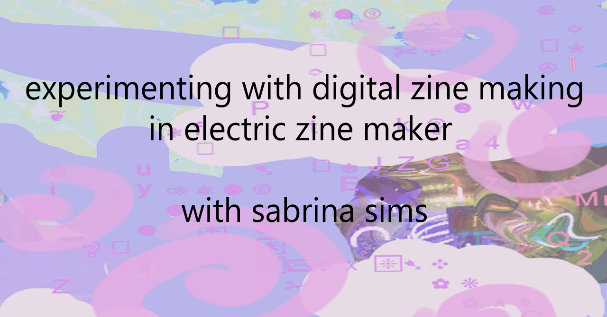

### Description 

Have you ever thought, I just wanna make some weird fun art! Or wondered how you could be more creative? Those are questions a lot of people ask (and I ask myself), and here's some answers maybe?? In this hour long workshop, Sabrina Sims, a Afro Puerto Rican woman, artist and zinester, will guide participants in an exploration of color, textures and words using the Electric Zine Maker. The Electric Zine Maker is a program and "art toy" made by amazingly inventive developer Nathalie Lawhead. It lets people make zines in a flash with preset formats and a playful array of drawing and image manipulation tools. It brings to mind the joyful creativity of programs like Microsoft Paint and Kidpix with a lot more cool glitchiness. 

### Workshop highlights:

- an overview of what a zine is and some approaches to making them
- talking about what you can do with the zine maker with a live demo
- free time to make a zine and chat with other participants
- help with ideas and troubleshooting from Sabrina

### Who's this workshop for:

- everybody! you don't have to be an artist or tech savvy to enjoy it. And if you are, that's awesome too!!

Participiants are encouraged to gather some digital images to use in the workshop. You might want to look for clip art, colored backgrounds and anything else that inspires you. The very loose prompt is summer, but feel free to do whatever you want. People who register in advance will get a digital collage kit to use in the workshop if they want more inspiration and pictures. 

Some sites for royalty free images are:

- [Pixabay](https://pixabay.com/)
- [Pexels](https://www.pexels.com/royalty-free-images)
- [Clipart Library](http://clipart-library.com/)

[Link to Electric Zine Maker](https://alienmelon.itch.io/electric-zine-maker) *price: pay as you wish*

## Lesson Plan/Walkthrough

### What's a zine?

A zine (pronounced zeen) is a booklet, usually low cost and self published. It’s great for sharing art, stories and information. I’ve used zines as a way to explore all these things and so have lots of other people. Anyone can make a zine about anything, which is what makes them special.

### Examples of zines

Since 2019, I’ve made about 35 zines and counting! I’ve made so many because it’s fun. Some of my go-to topics are hard to deal with feelings, friendships, my interests in cuteness/femme-ness and silly things that have happened to me. 

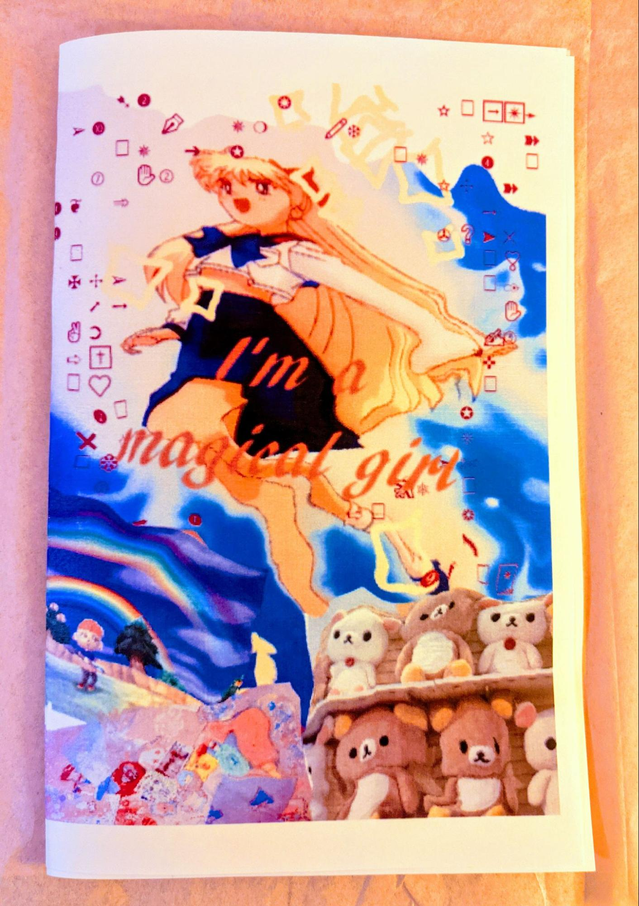
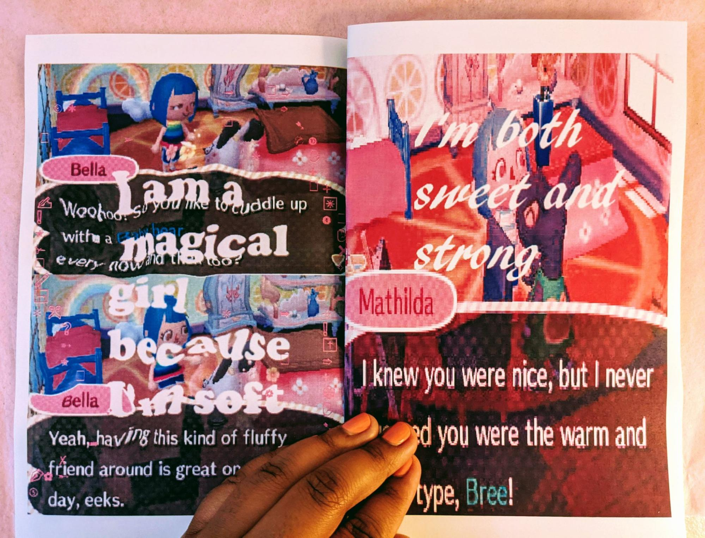

Pictured above: Spreads from “I’m a magical girl”, a zine about being comfortable with being femme and liking cute things. 

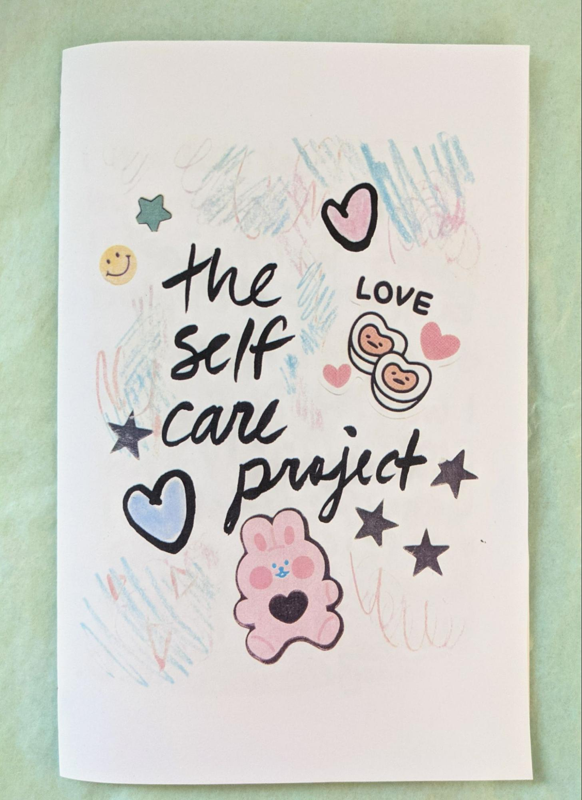
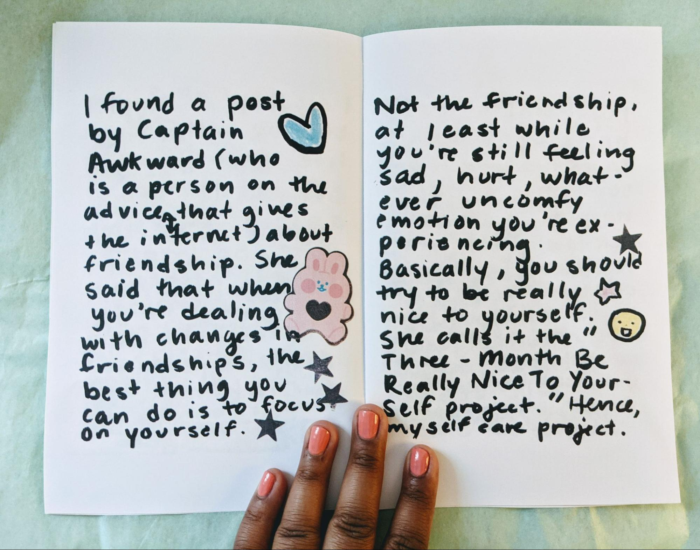

Pictured above: “the self care project”, a zine about taking care of yourself when you’re lonely

Hopefully seeing these zines gives you an idea of what you can do with the format. There are so many examples online of zines. Some cool people that make zines are @_ara_pena_ and @blkgrlswurld_zine on instagram.
 
### Thinking about topics

When it comes to making your own zine, it can be a bit overwhelming to pick a topic. Here are some prompts you can use to get ideas flowing! 

- What’s something you love talking about? Is it a hobby, some type of food you love maybe? 
- What colors/shapes do you like? Maybe soft shapes or loud colors?  
- Is there something funny or interesting that’s happened to you? 

Even if you can’t think about a specific topic, it’s nice to play around and draw or write whatever comes to mind. After all, zines are about experimenting. They don’t have to be perfect. And often the imperfect ones are pretty interesting! 

### Why Electric Zine Maker? 

The Electric Zine Maker is a wonderful program made by game maker Nathalie Lawhead. I love this program because it’s a playful, fun and accessible way to make zines digitally. It has so many inventive tools that are good for making digital art in general. I’ve created zines on it and have really like the experience. 

### Overview on how to use Electric Zine Maker

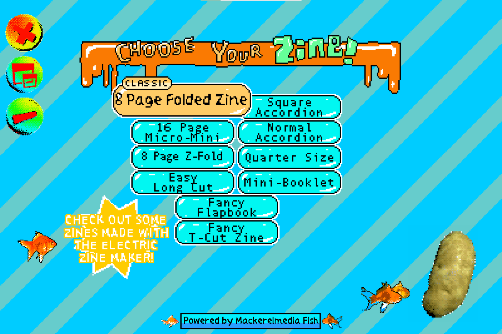

This is the screen you’ll get after starting the program. If you have any light sensitivities, I’d recommend lowering the brightness on your screen because it’s very colorful. 

### Picking a size/format

On the main page, you’ll see a bunch of names like “8 page folded zine” and “square accordion”. These are the different zine formats the program has.  For beginners, I’d suggest picking the classic 8 page folded zine. It allows you to print or download the zine as one sheet & a pdf. When you download a zine as a pdf, it lets you print it as a large letter sized booklet. 

### Navigating your pages 

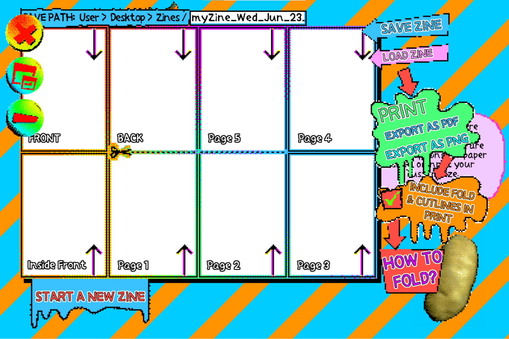

This page shows you all of the pages in your zine. If you want to work on your cover, click on the page that says “FRONT”. You can come back to this page whenever you want. It’s good to check and see how your pages look together every once in a while. Zine makers would call this a **spread** of your pages.

### Tools in the Zine Maker

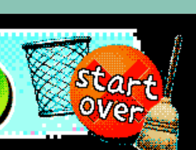

Before starting a zine, feel free to play around with the tools in the program. The nice thing is that there's a start over tool (a big red button with an X) that lets you clear the page if you don’t like a page.
Pictured above: the big red start over button

To make the blank pages less intimidating, you can use most of the tools to put down colors. It’s like photoshop or Microsoft Paint where there are paint tools that allow you to draw. 

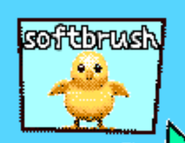
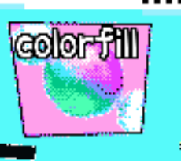

I like the soft brush and color fill tools to start out with. 
 
 
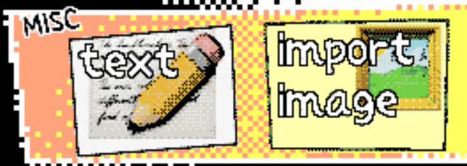

You can also import pictures from your computer and add text to fill up space. 

Where the zine maker really shines is image manipulation. 
For example, the goldfish tool lets you make images look like they have watery ripples in them. 

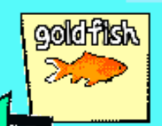

I used the goldfish tool on this image below 

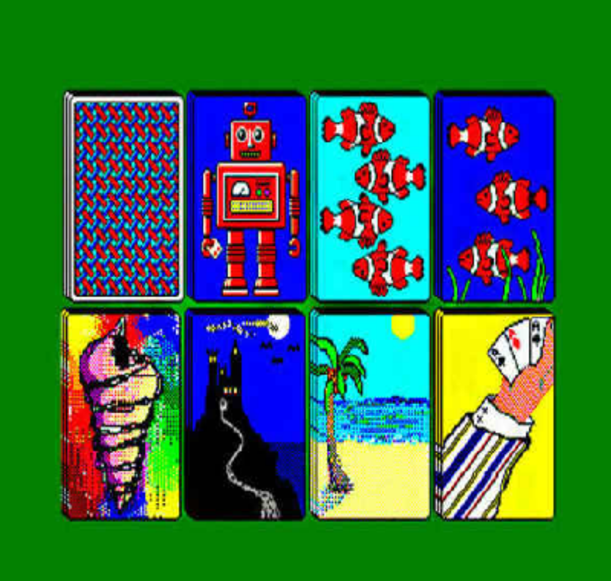

And got this: 
 
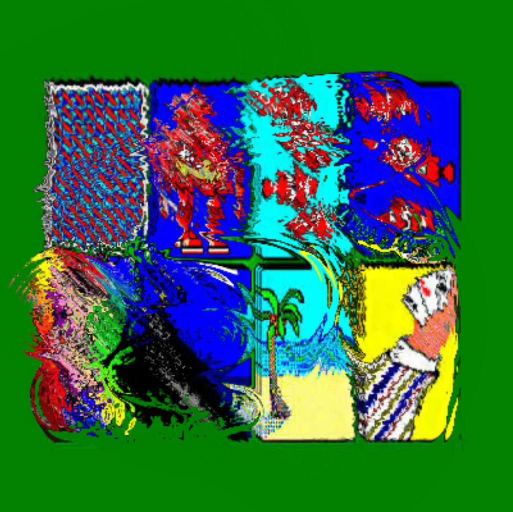

Just play around and see what you get!  I also like the “color factory” tool for messing with the colors in my pages. 

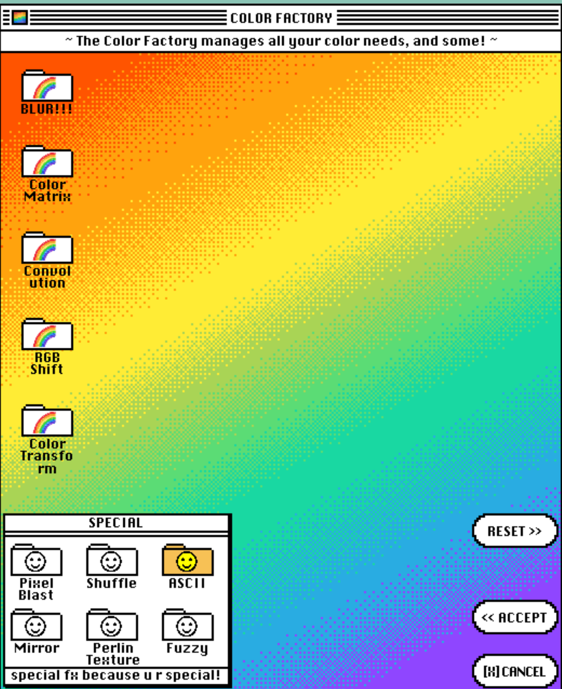

If you really like something you made in a page, you can click “export this panel” and save it as a jpg or png file.
 
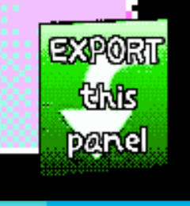

I recommend doing this if you’re scared of messing up something cool you made. The Zine Maker doesn’t have layers like photoshop. So although you can use the undo/redo buttons in EZM, it’s hard to fix something you did a while ago. 

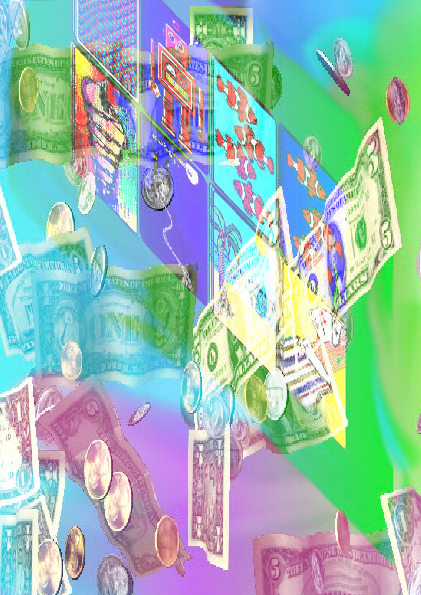
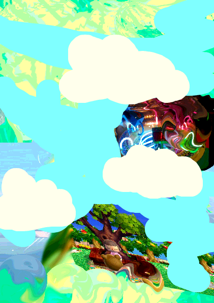

In the workshop, I made the first 2 panels and exported them. The last one I made in the zine maker and used it as the base for the workshop’s header image. 

### Saving your zine

When you’re done with a panel or zine, you can save it and return to the menu. 

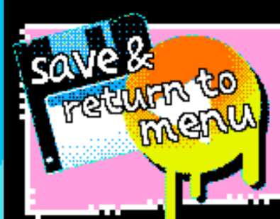

This is what the saving options look like: 

If you want to take a break and come back, you can save/load the zine. To have save it as a file to print or put online, you can export as pdf/png as I mentioned earlier. I’d do both because it never hurts to have backups! There is also a very helpful potato that tells you how to fold zines. Printing your zines can be very satisfying. Sometimes folding is a bit confusing so the guides help. 

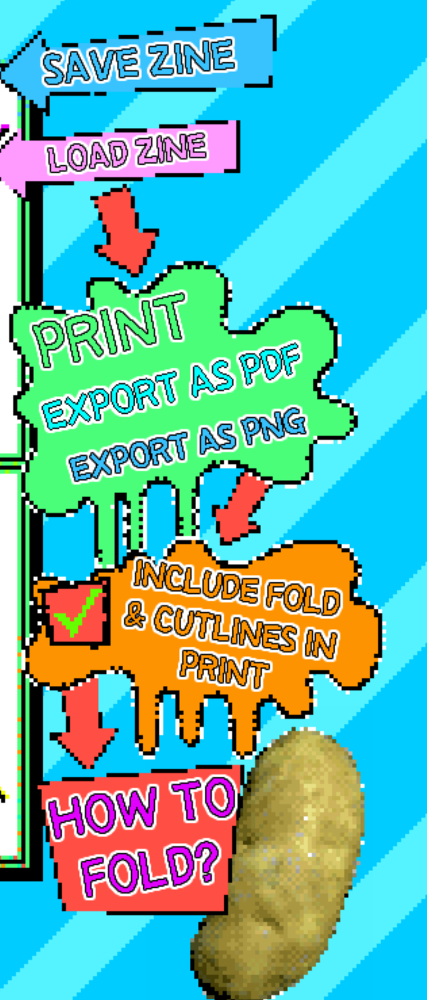

And that’s basically it! I hope this workshop gave you some ideas about what you can do with zine making! 

*--Sabrina*
________
