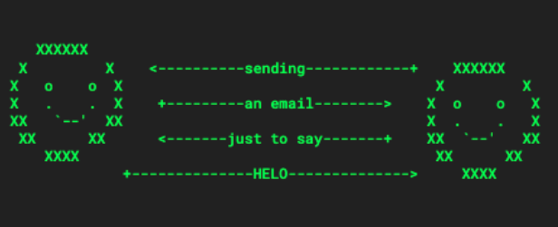

# EMAIL! workshop

Taught by: Char Stiles (contact@charstiles.com)

Sunday, November 1, 2020 at 3PM

Virtual link acquired by signing up on Withfriends.

### Description

In this workshop we are going to talk about EMAIL! Yes, email! Not to complain about email (necessarily), but the good parts about email like the cool stuff that we can do with it: maintain a git repo, display html, run your own email server, use a CLI inbox, and make art. Good ol email only relies on a protocol from the 70s and it’s not going anywhere. For many of us it is the most used form of digital communication that doesn’t necessarily need to rely on big tech companies.We will converse about the future of email, our personal pasts of email, we can vent about email etiquette we can even read email’s natal chart if that’s where the conversation leads us.
Then in the second part of the workshop we will explore with toy email addresses that everyone will get an alternate email universe, where the emails we send are altered by a mischievous email server.

### Schedule

3:00-3:30 Intro and presentation.

3:30-3:40 Discussion.

3:40-3:55 draft ideas of your fantasy or real email list / newsletter

3:55-4:10 Get computerfaith email addresses, log on, embark on LARPing inbox 0 and starting your an email based community, using the mischievous email server Computerfaith. 

4:10-4:20 Final Discussion

### Links

[Withfriends Event](https://withfriends.co/event/5168217/babycastles_academy_email)

[Slides](https://docs.google.com/presentation/d/18RrI0cX4i7_hB3McEh7z2nrL2SGs32LawmxhrK4-7UE/edit?usp=sharing)

[Email Server](http://box.computerfaith.com/mail)

### Support

This program is supported, in part, by public funds from the New York City Department of Cultural Affairs in partnership with the City Council. And by Babycastles members. Thank you.
