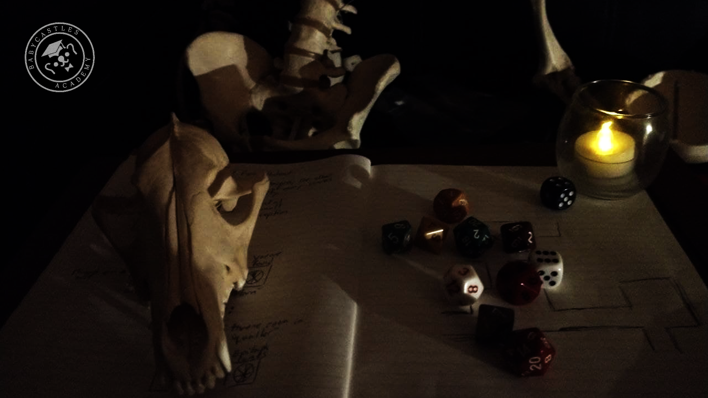

# Being the Game Master

March 21, 2021  
Hyacinth Ramsay  
@Synodai  

## Overview
Learn to facilitate tabletop role playing games. This is a system-agnistic approach to building and running tabletop roleplaying sessions and longer term campaigns. We'll discuss a bunch of tools and techniques for planning, prep, and moment-to-moment gameplay.

## Lesson Plan
1. The role of a Game Master
2. Things to be aware of when starting out
3. Prep
   1. Managing long term progression
   2. Session level prep
4. Running the game
   1. Tips for thinking on your feet
   2. Working with your players' characters
5. Ending the session

## The Role of the Game Master
As a GM, you are a storyteller (though not the only storyteller, as you and your players are there to tell a story together), as well as the engine that makes the game work. In games that require GMs, there's not a ton that can happen without one, as it were. As a result, there is a bit of an intrinsic power difference between the GM and the other players which is worth taking into account as you plan your games. Additionally, maybe your most important role is to ensure that everyone has a good time to the best of your ability, which means managing the flow of the story so that it doesn't go places that make anyone at the table uncomfortable or lessen the experience for anyone.

## Things to be aware of when starting out
- GMing requires a ton of social skills that can be practiced and honed (there's an amount of improv, acting, complex decision making, discussion & listening involved)
- Knowing what your players are interested in, how they play, and the direction they want to take their characters in will help you plan and facilitate games better
- You're not an antagonist, and shouldn't be trying to "beat" your players
- You should, however, work to create tension, wrinkles, conflict, and challenge (both narrative and mechanical where appropriate) for your players, to the extent that they are comfortable
- When you're unsure about any of the above, it's always a good idea to talk to your players to see where they're at
- Failure should be at very least interesting and at most fun for your players--you shouldn't make them roll dice if any outcome will lead to a dead end or take the momentum out of a situation
- Show the barrel of the gun before firing it--no one likes to have a trap sprung on them that they didn't know to even look for
- Players can know things that their characters don't--if everyone is bought in and is roleplaying, this kind of information exchange can help you all tell better stories

## Prep

### Big Picture Prep
*When deciding what direction a campaign should go, it's useful to ask:*
- What are the hooks your players might pursue
- What are other characters (or factions!) up to between sessions
  - For important NPCs or factions, I'll often have a goal that each is working towards and a general amount of time that each might take to complete
- What locations exist--where might be interesting to explore in the next or future sessions
- Have you foreshadowed anything important that you want to pay off? Is it too soon to pay off something?
- Are there any characters or events that are necessary to move the larger story, and is it the right time to introduce them
- (I use trello for keeping track of all of this stuff--a spreadsheet or notebook or a dozen other tools will also do fine)

*When building sessions as they fit into a larger campaign, its helpful to:*
- Think of sessions as taking a unit of time, Other Things can happen during that time that don't directly involve the players
- Think about the choices your players make, both in terms of what you providing them and how they "answer"

### Session Level Prep
*When sitting down to think about what a session is:*
- It's sometimes helpful to write down a list of moods/themes/aesthetic touchstones/genre conventions you want to explore
- What should the arc of the session be like and what are the stakes?
- What **needs** to happen in the session or block of content

*When designing the geography of a sessions:*
- Where can players go, what is available for them to do at any given point, are you going to hand-craft a specific puzzle or encounter with a specific, multi-tiered solution or are you going to build situations based on what your players are going to be doing on the fly?
- It's often useful to think of the main **things** that need to happen in a given session or chunk of content (e.g. a dungeon), and to have an amount of other components or encounters you can slot in when it makes sense to
- What encounters can or should exist?
- Pacing encounters, having more high energy or high tension stuff mixed in with lower energy exploration etc.
  - Building to a climax is often useful as well

*When designing encounters*
- Consider: kind, what's involved, which of your players are good at overcoming the specific challenge, how many possible steps are involved, what happens if things go bad
- Relatedly, have several different sorts of challenges in your toolbelt to call on when you need to change things up to fit the play styles of different players or characters(e.g. unless you have a party of all fighters or all rogues, you shouldn't make all of your encounters hinge on punching or sneaking)

## Running the Game
- For each area, encounter, shift in tone or mood, set and describe the scene
  - A lot of GMs like to use filmic metaphors (e.g. what does `the camera` see)
- Call for rolls andor stat checks whenever it would be interesting and appropriate
- Keep the whole view of the scenario in focus--whenever things go too far afield, ask yourself if you would rather they didn't and introduce an element or some to redirct focus on the task at hand (or don't, if that's how you like to run your games)
  - This becomes more of an issue when there's less of a directed path--if you allow players to approach a scenario from a bunch of different angles, you will need to have a tighter handle on pacing and dispensing information--if you had meant for one clue, for instance, to be in one location but the players have never found it, it's fine to move that to a location they're searching if it makes sense to
- Try to follow the logic of what's presently going on--it's often best to not introduce too many elements that don't go anywhere. Its fine if you do though, sometimes a bit of "useless" characterization of a setting or whatever can go a long way
- Remember: failure should be cool & engaging, insinuate threats exist before using them, dramatic irony is fun, don't be a jerk to your players

## Ending the session
I usually like to end on some kind of mystery or a big semiclimactic event
Debrief with your players if you're able to. Ask what worked and what didn't. Make sure people felt okay about what happened, that their characters got enough screen time, that they're cool with the direction of the story, etc.

[Here's the scenario I wrote for this workshop--have fun with it](https://hyacinthnil.itch.io/a-disappearance-in-winterbreach/download/UO9Q2Juz2SZIcKPwwkF2F5FqE_y_9UmY8xjfz_Cv)
