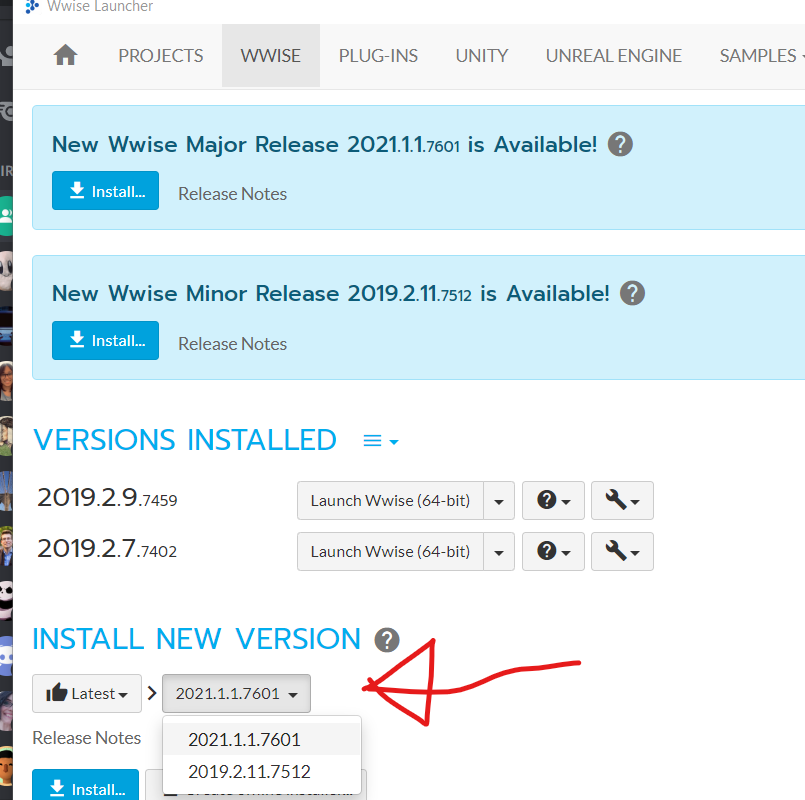
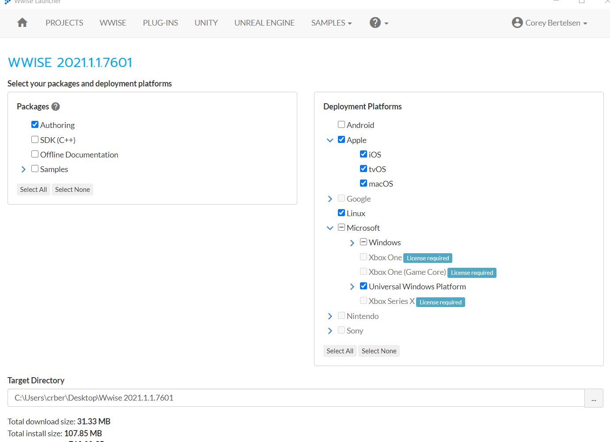
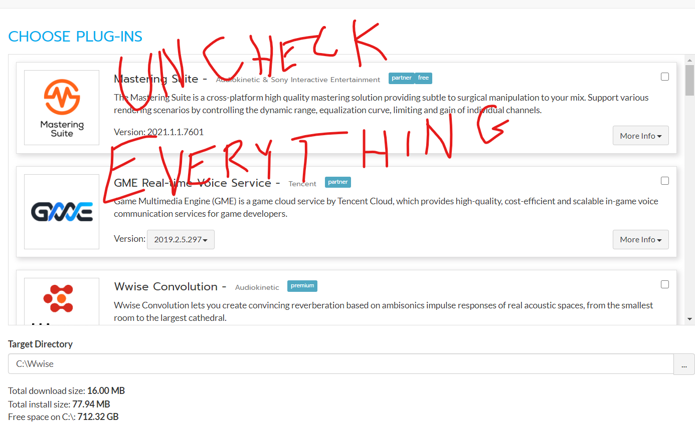

# QWOP QWOP Revolution
A Sample Rhythm Game for Babycastles Academy

This is the project repo for the BabyCastles academy class on creating Rhythm Games in Unity/Wwise!

Corey Bertelsen
@super8ude
crbertelsen@gmail.com

## Overview:

This class is about Rhythm Games, and how to build them in Unity and Wwise.  We'll be using the template project at this repo as a guide.

### [Slides are available here](https://docs.google.com/presentation/d/1fQVSYs5EKnu26jL4AQlMtb9-fXGOVe64DrgLHwGRwdE/edit?usp=sharing)

### Tech used:

Wwise version 2021.1.1.xxx

Unity version 2020.3.2 or later

### Familiarity + Pace
I'm hoping this is will be a pretty approachable workshop.  The example project might feel a bit overwhelming to beginner Unity users.  I'll try to slow down if I'm going too fast.  If we don't get to everything, you'll at least have the project repo to draw from.

We're using two big and clunky pieces of software (both Unity and Wwise take years to fully master), so I'm going to gloss over a lot of features.  I'm hoping you can at least get them working "good enough" to do what we need them for - creating rhythm games!

Try to have Unity and Wwise installed before the class starts.  Unity is a big installer and can take a while.

# Outline:

## Part 1: set up and rhythm game design

- Downloading the project repo
- What's a rhythm game, and how do you make one?
- Call-Response gameplay
- Evaluation windows
- Some common issues in making music-based games.

## Part 2: the Unity project

- Testing the game in Unity
- Where to change what buttons are used.
- On beat + on bar effects

## Part 3: the Wwise project

- quick overview of Wwise
  - music, events, and sound banks
  - creating sounds (because you can't use Unity audio)
  - all the fancy stuff we won't touch for this class
- the musical view + timeline
  - import music, set the tempo correctly
  - viewing+snapping to beats and bars
  - making cue markers
  - (maybe, if we have time) using MIDI and incorporating sustain events

# Software Set Up:

## Unity

The quickest way to download Unity is [through this link](https://unity3d.com/unity/qa/lts-releases?version=2020.3).  This might overwrite your old version of Unity, so be careful if you already have it!

The longer, Unity-sanctioned method, is to [go to this link](https://store.unity.com/download?ref=personal) and download Unity Hub.  You'll have to create a Unity ID.

Then, in Unity Hub: 
1. Go to "Installs"
2. Click "Add"
3. Choose the recommended release (2020.3.8 LTS as of writing)
4. Add any build platforms that make sense for your work - you can add more later.  
5. It also makes sense to include Visual Studio Community if you don't already have an IDE.
6. Click "Done" and wait for installation to complete

## Wwise

1. [Register/Make an account](https://www.audiokinetic.com/sign-in/)
2. Login and [Download the Wwise Launcher](https://www.audiokinetic.com/download/)

3. In the wwise launcher, go to the Wwise Tab and go to "Install New Version".  Select the 2021.x version.  

4. In the next page, left hand column, you only need the Authoring Tool. If you eventually want to incorporate Wwise into your own games, you'll need the SDK. But that's much bigger, so maybe worry about that later.  In the right hand column, select the platforms you want to build for.  

5. In the next page, scroll down and uncheck everything.  We're not using plugins, and this is trying to sell you stuff.  

6. Then hit Install!
